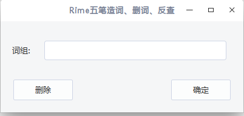

# 

输入待添加、删除的词语，点击确定把词加入词库，点击删除把词从词库删除

添加或删除词语后，会在输入条内显示该词语的编码，并提示相应的执行结果

将***add_wubi.c***中的相应词库文件路径改为自己的文件路径。

然后执行`make`

`./main`

可以将执行*main*的命令，绑定到快捷键上，以方便添加词

同时可以与重新部署命令，绑定在一起，来使用修改后的词库

#### 重新部署命令

**ibus-rime:`rm ~/.config/ibus/rime/default.yaml; ibus-daemon -drx`**

**fcitx-rime:**`fcitx -r`